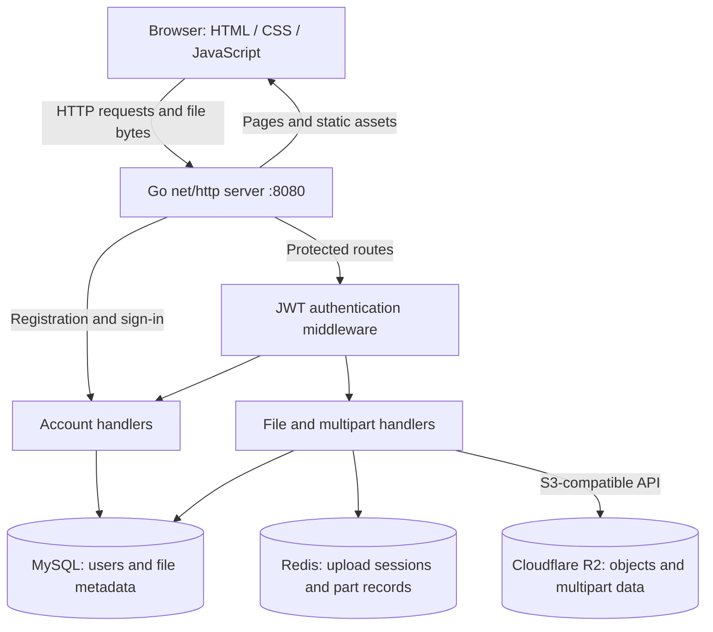
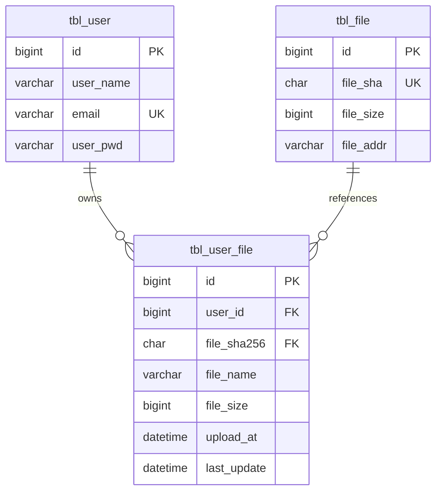
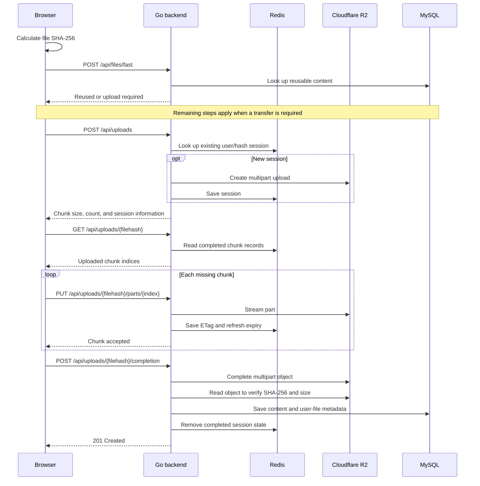

# GoCloudStorage

A full-stack cloud file storage application built with **Go, MySQL, Redis, and Cloudflare R2**. Users can manage files through a browser, resume interrupted multipart uploads, and download content verified with SHA-256.

## Highlight features

- **Resumable multipart uploads** — files are split into 5 MiB chunks and streamed through the Go server to R2. Redis records upload sessions and completed parts so retries can skip chunks already stored.
- **File integrity verification** — ordinary uploads are hashed on the server. Completed multipart objects are read back from R2 and checked against the expected SHA-256 and file size before metadata is saved.
- **Content deduplication and fast upload** — shared content is identified by SHA-256, while each user retains a separate filename and file record. The fast-upload API can reuse an existing object without transferring its bytes again. See the current access-control limitation below.
- **Account authentication** — bcrypt password hashing, signed JWTs in an HttpOnly cookie, and authentication middleware for protected pages and APIs.
- **Personal file management** — upload, paginated listing, rename, download, and delete, with file operations scoped to the signed-in user's ID.
- **Reference-aware deletion** — deleting a user-file record preserves content that other user-file records still reference; the final reference allows storage cleanup.
- **Browser interface** — drag-and-drop file selection, upload progress, resumable transfer feedback, and account management using HTML, CSS, and JavaScript.

## Architecture



The backend is a single Go application with separate packages for authentication, request handling, persistence, upload state, and object storage. File bytes pass through the backend; the browser does not receive R2 credentials or upload directly to R2.

| Component | Responsibility | Technology |
| --- | --- | --- |
| Web interface | Pages, file selection, progress display, and API calls | HTML, CSS, JavaScript |
| HTTP server | Method-aware routes, static assets, and request handling | Go `net/http` |
| Authentication | Password verification and authenticated user identity | bcrypt, JWT HS256 |
| Metadata store | Accounts, file ownership, names, hashes, and storage locations | MySQL 8.4 |
| Upload state | Temporary sessions and completed multipart part information | Redis 7 |
| Object store | Persistent file bytes and multipart assembly | Cloudflare R2 via AWS SDK for Go v2 |
| Local infrastructure | Database and Redis containers | Docker Compose |

### Data model



`tbl_file` represents shared content. `tbl_user_file` represents a user's named reference to that content. This separation supports deduplication without making filenames global. API file IDs refer to `tbl_user_file.id`, not the shared content row. The full schema is in [doc/table.sql](doc/table.sql).

### Multipart upload flow



Upload sessions are scoped by user ID and file hash. New sessions expire after 24 hours, and successful part uploads refresh the session and part-state expiry. The client uploads missing chunks sequentially. Retrying with the same file can resume an active session; expired sessions require a new upload. The API uses zero-based chunk indices, which the backend translates to R2's one-based part numbers.

## API reference

**Local base URL:** `http://localhost:8080`

### Request and authentication conventions

- Fields below are case-sensitive. Form requests use `application/x-www-form-urlencoded`, except ordinary file uploads and raw chunk uploads.
- Sign-in sets the `access_token` cookie. Protected APIs require this cookie; they do not use an Authorization bearer header.
- JWTs expire after 24 hours. The cookie uses `HttpOnly` and `SameSite=Lax`; `Secure` is set when the backend receives a TLS request.
- `{id}` is a positive user-file record ID. `{filehash}` is a 64-character hexadecimal SHA-256 hash.
- Errors are generally plain text rather than a JSON error envelope. Common statuses are `400` for invalid input, `401` for missing/invalid authentication, `404` for unavailable files or sessions, `409` for conflicts, and `500` for backend failures.

### Accounts and sessions

| Method | Endpoint | Authentication | Form fields | Success response |
| --- | --- | --- | --- | --- |
| POST | `/api/users` | Public | `userName`, `email`, `userPwd` | `201` |
| POST | `/api/sessions` | Public | `email`, `userPwd` | `200`, `SUCCESS`, and access-token cookie |
| POST | `/api/sessions/signout` | No valid session required | None | `204`; clears the cookie |
| GET | `/api/users/me` | Required | None | `200` JSON: `username`, `email`, `signupAt`, `lastActive` |
| PATCH | `/api/users/me/name` | Required | `userName` | `200`, `SUCCESS` |
| PATCH | `/api/users/me/password` | Required | `currentPwd`, `newPwd` | `200`, `SUCCESS` |
| PATCH | `/api/users/me/email` | Required | `email` | `200`, `SUCCESS` |

### Files

All endpoints in this table require authentication.

| Method | Endpoint | Request | Success response |
| --- | --- | --- | --- |
| POST | `/api/files` | `multipart/form-data` with field `file` | `201`, `SUCCESS` |
| POST | `/api/files/fast` | Form: `filehash`, `filename`, `filesize` in bytes | `201` when reused; `200` when upload is required |
| GET | `/api/files` | Query: `page` (default `1`), `pageSize` (default `20`) | `200`, JSON array of file records |
| GET | `/api/files/{id}/content` | No body | `200`, file content with download headers |
| PATCH | `/api/files/{id}` | Form: `name` | `200`, JSON: `id`, `fileName` |
| DELETE | `/api/files/{id}` | No body | `204` |

Each file-list record contains `id`, `userId` (a string), `fileHash`, `fileName`, `fileSize`, `uploadAt`, and `lastUpdated`.

Fast-upload responses:

```json
{ "reused": true, "status": "completed" }
```

```json
{ "reused": false, "status": "upload_required" }
```

### Multipart uploads

All endpoints in this table require authentication.

| Method | Endpoint | Request | Success response |
| --- | --- | --- | --- |
| POST | `/api/uploads` | Form: `filehash`, `filename`, `filesize` in bytes | `201` for a new session; `200` for an existing session |
| GET | `/api/uploads/{filehash}` | No body | `200`, JSON: `fileHash`, `chunkCount`, `uploadedChunks`, `status` |
| PUT | `/api/uploads/{filehash}/parts/{index}` | Raw bytes, `application/octet-stream` | `200`, JSON: `status`, `uploadId`, `index` |
| POST | `/api/uploads/{filehash}/completion` | No body | `201`, JSON: `status`, `uploadId`, `fileHash`, `fileSize` |

Initialization returns `fileHash`, `fileSize`, `fileName`, `uploadId`, `chunkSize`, `chunkCount`, `status`, and `createdAt`. Chunks are 5 MiB except for the final chunk, which may be smaller; the implementation permits at most 10,000 parts. Completion checks that every expected chunk is present and verifies the assembled object's size and hash.

Example status response for a three-part upload with two parts stored (`fileHash` abbreviated for readability):

```json
{
  "fileHash": "<64-character-sha256>",
  "chunkCount": 3,
  "uploadedChunks": [0, 1],
  "status": "uploading"
}
```

### Example: sign in, upload, and list files

These examples use curl and a local cookie jar. On Windows PowerShell, use `curl.exe` if `curl` resolves to a PowerShell alias. Replace the credentials and file path with your own.

```sh
curl -X POST http://localhost:8080/api/users --data-urlencode "userName=demo" --data-urlencode "email=demo@example.com" --data-urlencode "userPwd=example-password"
curl -c cookies.txt -X POST http://localhost:8080/api/sessions --data-urlencode "email=demo@example.com" --data-urlencode "userPwd=example-password"
curl -b cookies.txt -F "file=@example.txt" http://localhost:8080/api/files
curl -b cookies.txt "http://localhost:8080/api/files?page=1&pageSize=20"
curl -b cookies.txt -X POST http://localhost:8080/api/sessions/signout
```

The cookie jar contains a session credential; keep it out of version control.

## Getting started

### Prerequisites

- Go `1.26.4`, as declared in `go.mod`.
- Docker with Docker Compose.
- A Cloudflare R2 bucket and access credentials for that bucket.
- Available local ports `8080`, `3306`, and `6379`.

Run commands from the directory containing `main.go` and `compose.yaml`.

### Environment configuration

Create or update `.env` with your own values. The file is ignored by Git, and existing process environment variables take precedence when the Go application loads it.

```dotenv
MYSQL_ROOT_PASSWORD=replace-with-a-local-root-password
MYSQL_DATABASE=gocloudstorage
MYSQL_USER=gocloudstorage
MYSQL_PASSWORD=replace-with-a-local-app-password

REDIS_ADDR=127.0.0.1:6379
REDIS_DB=0
REDIS_PASSWORD=

JWT_SECRET=replace-with-a-random-secret-of-at-least-32-bytes

R2_ACCESS_KEY_ID=replace-with-your-access-key-id
R2_SECRET_ACCESS_KEY=replace-with-your-secret-access-key
R2_ENDPOINT=https://YOUR_ACCOUNT_ID.r2.cloudflarestorage.com
R2_BUCKET=replace-with-your-test-bucket-name
R2_REGION=auto
```

The R2 endpoint must be an HTTPS service URL without a bucket path. The supplied local Redis container has no password, so leave `REDIS_PASSWORD` empty for this configuration.

### Run locally

```sh
docker compose up -d mysql redis
docker compose ps
docker compose logs mysql redis
```

Once both services are ready:

```sh
go mod download
go run .
```

Open [GoCloudStorage](http://localhost:8080) and register an account. Keep the working directory at the project root so the server can find `static/`.

MySQL loads `doc/table.sql` when its data volume is first initialized. Existing volumes are not automatically migrated after schema changes. To stop services while retaining data, run `docker compose stop`.

The local setup above runs Go on the host. The complete Compose stack runs with `docker compose up -d`: Caddy publishes ports `80` and `443`, the application is reachable only through the private Compose network, and MySQL and Redis remain bound to loopback.

## Deploy to an Ubuntu Azure VM

The production deployment runs Caddy, the Go application, MySQL, and Redis in Docker Compose. Caddy obtains HTTPS certificates automatically for `emulisygocloud.southeastasia.cloudapp.azure.com` and proxies to the application over the private Compose network. Only SSH, HTTP, and HTTPS should be allowed by the Azure Network Security Group; do not open ports `8080`, `3306`, or `6379`.

On the VM, clone the repository and run the one-time setup:

```sh
git clone YOUR_REPOSITORY_URL goCloudStorage
cd goCloudStorage
sudo bash deploy/setup-server.sh
nano /opt/gocloudstorage/.env
```

Use the environment variables shown above in `/opt/gocloudstorage/.env`, then log out and back in so Docker group membership is active.

Add `AZURE_VM_HOST`, `AZURE_VM_USER`, `AZURE_VM_SSH_PRIVATE_KEY`, and `AZURE_VM_SSH_KNOWN_HOSTS` as GitHub Actions secrets. Generate the known-hosts value from a trusted machine with `ssh-keyscan -H emulisygocloud.southeastasia.cloudapp.azure.com`, verify its fingerprint against the VM, and save the verified output. Pushes to `main` synchronize the repository while preserving the VM's `.env`, validate the Caddy configuration, and restart the complete Compose stack. The workflow can also be started manually with **Run workflow** in GitHub Actions.

## Project structure

```text
.
|-- main.go              # Startup and HTTP routes
|-- auth/                # JWT and authentication middleware
|-- handler/             # Pages, accounts, files, and multipart handlers
|-- db/                  # MySQL queries and metadata transactions
|-- cache/               # Redis connection and upload state types
|-- storage/             # R2 object and multipart operations
|-- util/                # Shared helpers, including SHA-256
|-- static/
|   |-- view/            # HTML pages
|   `-- assets/          # CSS, JavaScript, and favicon
|-- doc/table.sql        # Database schema
|-- compose.yaml         # Caddy, application, MySQL, and Redis services
|-- dockerfile           # Multi-stage application image
|-- deploy/              # Caddy configuration and Ubuntu setup script
|-- .github/workflows/   # Continuous deployment workflow
`-- go.mod               # Go version and dependencies
```

## Current limitations

- Fast upload currently reuses content based on hash and size without proving the caller owns it. Private multi-user deployment requires restricting reuse or adding ownership verification.
- MySQL and R2 operations are not one atomic transaction. Objects retained after uncertain failures need reconciliation; expired Redis sessions also require abandoned multipart-upload cleanup.
- A multipart cancellation handler exists, but it is not registered as an HTTP route.
- No Go test files were present when this documentation was written. `go build ./...`, `go vet ./...`, and `go test ./...` are development check commands, not evidence of tested production readiness.
