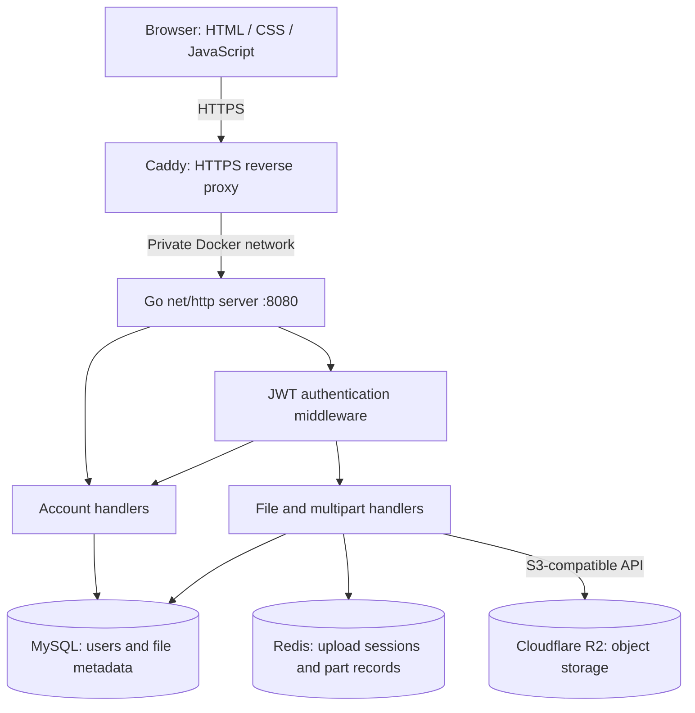
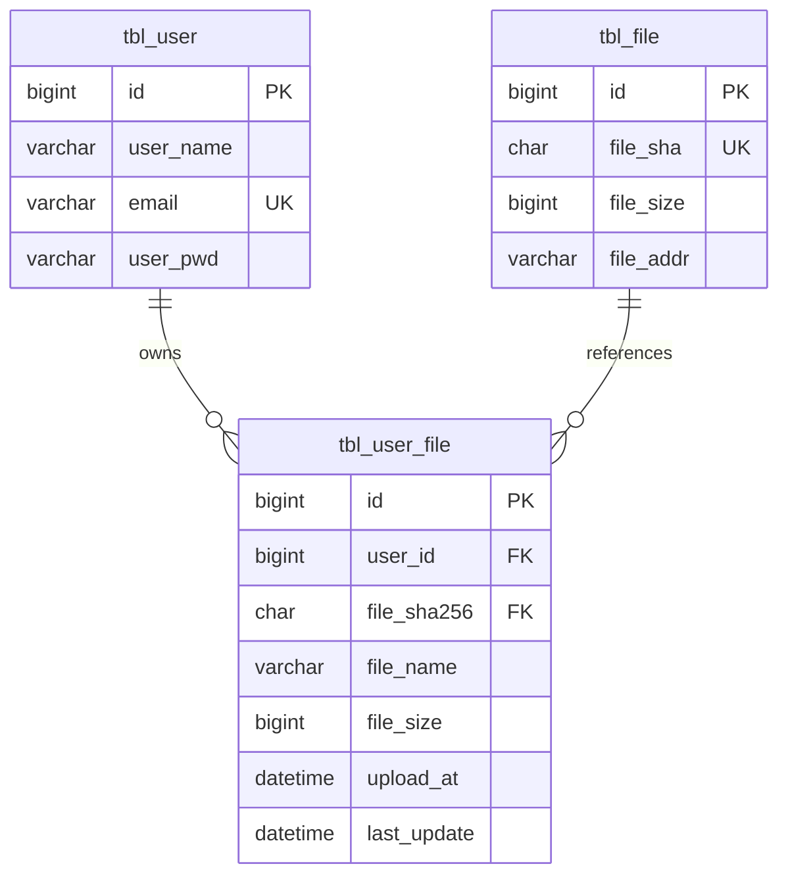
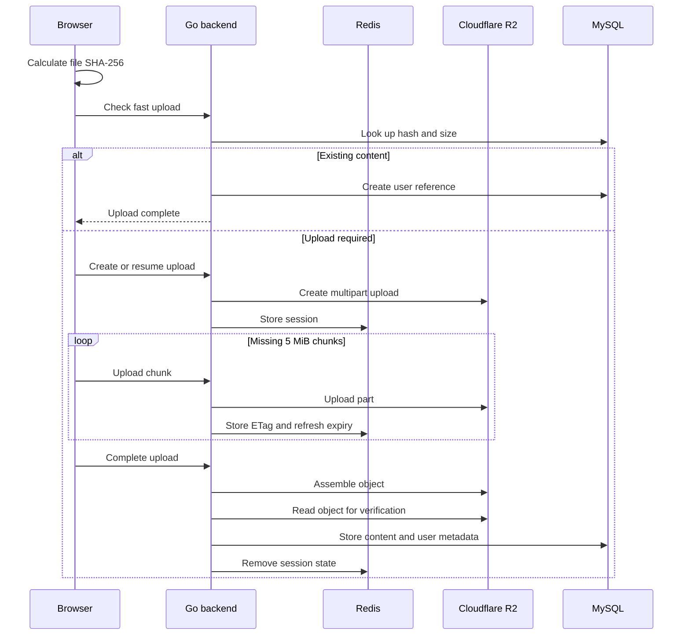

# GoCloudStorage Architecture

This document describes the system design, content-addressable storage model, multipart upload protocol, and HTTP API. For setup and deployment instructions, see the [README](Readme.md).

## System overview

The browser never receives R2 credentials or uploads directly to R2. File bytes pass through the Go backend, which enforces authentication, calculates or verifies content hashes, and coordinates metadata and upload state.

| Component | Responsibility | Technology |
| --- | --- | --- |
| Web interface | File selection, progress, account and file management | HTML, CSS, JavaScript |
| Edge proxy | Automatic HTTPS and reverse proxy | Caddy |
| Application | HTTP routes, authentication, uploads, downloads | Go `net/http` |
| Metadata store | Users, ownership, names, hashes, storage locations | MySQL 8.4 |
| Upload state | Resumable sessions and completed part metadata | Redis 7 |
| Object store | File content and multipart assembly | Cloudflare R2 |
| Runtime | Isolated services and private networking | Docker Compose |

In production, only Caddy publishes host ports 80 and 443. The Go application is reachable at `app:8080` only inside the Compose network. MySQL and Redis are bound to VM loopback for diagnostics and are not publicly exposed.

## Content-addressable storage

Files are addressed by their SHA-256 digest rather than their display name. The data model separates stored content from each user's reference to that content:

- `tbl_file` records one stored object for a unique SHA-256 digest.
- `tbl_user_file` records a user's filename and ownership reference to that object.
- The fast-upload endpoint can reuse existing content with the same hash and size instead of transferring the bytes again.
- Deleting a user reference preserves the underlying object while another reference exists. Removing the final reference allows object cleanup.

The complete schema is in [`doc/table.sql`](doc/table.sql).

## Resumable multipart uploads

Sessions are scoped by user ID and file hash and expire after 24 hours. Successful part uploads refresh the expiry. Public chunk indices are zero-based; the backend converts them to R2's one-based part numbers. Completion requires all expected parts and verifies both the assembled size and SHA-256 digest.

## Authentication and request conventions

- Sign-in returns a signed JWT in the `access_token` cookie.
- Protected routes resolve the authenticated user from that cookie.
- Passwords are hashed with bcrypt.
- JWTs expire after 24 hours and use HS256 with a secret of at least 32 bytes.
- Form field names and path parameters are case-sensitive.
- Errors are generally returned as plain text with standard HTTP status codes.

## HTTP API

### Accounts and sessions

| Method | Endpoint | Authentication | Request | Success |
| --- | --- | --- | --- | --- |
| POST | `/api/users` | Public | Form: `userName`, `email`, `userPwd` | `201` |
| POST | `/api/sessions` | Public | Form: `email`, `userPwd` | `200` and session cookie |
| POST | `/api/sessions/signout` | Optional | None | `204` |
| GET | `/api/users/me` | Required | None | User JSON |
| PATCH | `/api/users/me/name` | Required | Form: `userName` | `200` |
| PATCH | `/api/users/me/password` | Required | Form: `currentPwd`, `newPwd` | `200` |
| PATCH | `/api/users/me/email` | Required | Form: `email` | `200` |

### Files

| Method | Endpoint | Request | Success |
| --- | --- | --- | --- |
| POST | `/api/files` | Multipart field `file` | `201` |
| POST | `/api/files/fast` | Form: `filehash`, `filename`, `filesize` | Reused or upload-required JSON |
| GET | `/api/files` | Query: `page`, `pageSize` | Paginated file records |
| GET | `/api/files/{id}/content` | None | File download |
| PATCH | `/api/files/{id}` | Form: `name` | Updated file JSON |
| DELETE | `/api/files/{id}` | None | `204` |

### Multipart uploads

| Method | Endpoint | Request | Success |
| --- | --- | --- | --- |
| POST | `/api/uploads` | Form: `filehash`, `filename`, `filesize` | New or resumed session |
| GET | `/api/uploads/{filehash}` | None | Session and uploaded chunks |
| PUT | `/api/uploads/{filehash}/parts/{index}` | Raw chunk bytes | Stored part JSON |
| POST | `/api/uploads/{filehash}/completion` | None | Completed upload JSON |
| DELETE | `/api/uploads/{filehash}` | None | `204`; aborts R2 upload and removes Redis state |

All file and multipart endpoints require authentication. Chunks are 5 MiB except for the final chunk, and an upload may contain at most 10,000 parts.

## Consistency and security notes

- MySQL metadata and R2 object operations are not one atomic transaction. Production maintenance should reconcile objects retained after uncertain failures.
- Expired Redis sessions require periodic cleanup of abandoned R2 multipart uploads.
- Fast upload currently reuses content by hash and size. A hardened multi-tenant deployment should additionally prove that the requester is allowed to reference matching content.
- Caddy terminates public TLS; application, database, and cache traffic remains on the VM's private Docker network or loopback interface.
