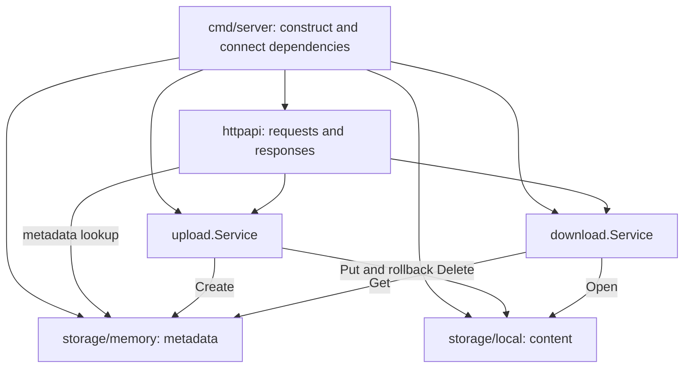

# Architecture

## Scope and boundaries

The service stores whole files on one local filesystem. A file has an opaque ID,
a display name, a measured byte count, and a checksum. The ID associates its
metadata record with its blob.

The domain packages contain values and errors. Upload and download services
coordinate operations through interfaces they own. Storage adapters implement
those interfaces implicitly, without importing the application services or HTTP
package. Startup selects and shares the concrete instances.

Arrows from services and handlers to adapters represent runtime calls through
interfaces. They do not imply source imports of concrete adapters.

### Package responsibilities

| Package | Owns | Must remain outside the package |
| --- | --- | --- |
| `files` | Metadata fields and shared metadata validation/errors | HTTP serialization and persistence configuration |
| `blob` | Content write results and shared blob errors | Filesystem implementation |
| `upload` | ID generation, content write, metadata creation, rollback | Multipart parsing and concrete storage selection |
| `download` | Metadata lookup, content opening, application error mapping | HTTP headers and response streaming |
| `httpapi` | Route registration, transport validation, JSON shapes, attachment headers | SQL and direct filesystem access |
| `storage/memory` | Metadata map, locking, create/get semantics | Application orchestration |
| `storage/local` | Key validation, content I/O, checksums, publication | Metadata records and HTTP status codes |
| `cmd/server` | Shared instances, runtime settings, startup, shutdown | Per-request business rules |

Within `httpapi`, `api.go` defines dependencies, `router.go` registers routes,
and `response.go` owns the shared JSON representation and writer. Endpoint files
handle their respective requests.

The metadata endpoint calls its narrow reader interface directly: its current
operation is a lookup and HTTP projection. A new service layer is warranted when
that lookup gains application rules.

## Upload lifecycle

1. The HTTP handler limits the request body and parses the multipart `file`
   field. It owns and closes the parsed content stream.
2. The upload service checks cancellation, rejects a blank name or nil reader,
   and generates a 128-bit random ID encoded as 32 lowercase hexadecimal digits.
3. The local adapter copies content into a temporary file in the blob directory.
   It measures bytes and computes SHA-256 during the same copy.
4. The adapter syncs and closes the temporary file, checks cancellation, and
   publishes the final key using a hard link. Publication fails if the destination
   already exists. Deferred cleanup attempts to remove the temporary name.
5. The service creates metadata only after the blob has been published.
6. The handler returns `201 Created`, metadata JSON, and a metadata location.

IDs are independent of file contents. Uploading the same bytes again creates a
new object. There is no deduplication, collision retry, or idempotency mechanism.

### Failure and rollback contract

The two storage operations do not share a transaction. The service relies on the
following contracts:

| Operation | Required semantics |
| --- | --- |
| `ContentStore.Put` | Publish complete content under a new key; never overwrite an existing key. A returned error must not leave a newly published blob at that key. |
| `MetadataWriter.Create` | Insert without overwriting. A returned error must mean that no new record was committed. |
| `ContentStore.Delete` | Remove the blob selected by key; a missing blob can be treated as already cleaned up during rollback. |

If metadata creation fails, the service attempts to delete the new blob. Cleanup
uses the request's context values but ignores its cancellation and original
deadline, then applies a separate five-second deadline. Backends must cooperate
with that context for the deadline to take effect.

The metadata error is returned even if rollback succeeds. If rollback also fails,
`errors.Join` preserves both causes for `errors.Is`/`errors.As`. A missing blob
during rollback is not considered an additional failure.

A process crash can interrupt the workflow between publication and metadata
creation. Cleanup failures can also leave orphaned content. There is currently no
reconciliation or orphan collector.

## Metadata and download lifecycle

A metadata request reads a value through `httpapi.MetadataReader` and maps it to
the HTTP response type. The checksum is omitted unless explicitly requested.

A download first retrieves metadata, then opens the blob using the ID in that
record. The service returns metadata and an open stream; the HTTP handler owns
that stream and closes it after copying or failure.

Missing metadata maps to `download.ErrNotFound`. A missing blob for existing
metadata maps to `download.ErrContentUnavailable`, distinguishing a missing
resource from inconsistent storage. Other backend errors retain their causes
through wrapping.

The download handler sets attachment headers and streams bytes. It does not
recompute the checksum or verify that content still matches the saved size.
After headers are sent, streaming errors are logged; an error message is not
appended to the binary response.

## Concurrency, cancellation, and ownership

- The metadata adapter protects its map with an `RWMutex`. Reads return metadata
  values, and create checks uniqueness while holding the write lock. Its zero
  value is usable; a store must not be copied after first use.
- The local adapter has immutable configuration and no shared upload buffer.
  Independent uploads can copy concurrently. Hard-link publication arbitrates
  competing writes even across store instances sharing a directory.
- Cancellation is cooperative. Local uploads check between reads and before
  publication. An already blocked source read or filesystem call cannot be
  interrupted by those checks.
- Metadata operations check cancellation before acquiring the lock and again
  after acquiring it; waiting on the lock itself is not context-aware.
- Blob `Open` checks context at entry. The returned file stream is not wrapped
  with context cancellation. The caller owns its lifetime.
- Constructors that accept dependencies expect non-nil implementations. Shared
  services and handlers require concurrency-safe dependencies.
- Application errors are independent of HTTP status codes. Handlers choose
  transport responses without exposing backend error details.

## Extension points

### PostgreSQL metadata — planned

A future metadata adapter belongs under `internal/storage` and should satisfy the
existing `Get` and `Create` contracts. It should preserve metadata validation and
error classification, enforce ID uniqueness, and be selected at startup.

The current rollback policy must be revisited before using a remote database.
A database may commit an insert while its acknowledgement is lost; an error can
then represent an uncertain outcome. Deleting the blob unconditionally would
leave a committed metadata record pointing to missing content. Define outcome
reconciliation and crash recovery before enabling that adapter.

Persistence acceptance should include restarting the process and retrieving
both metadata and identical file bytes from the same persistent stores.

### HTTP contract — planned

The current endpoints are documented in the [API reference](api.md). A later REST
redesign should make deliberate compatibility decisions about resource paths,
methods, validation, and error envelopes within the HTTP layer.

### Distribution — future scope

Remote storage nodes, placement metadata, chunking, replication, and coordination
are not implemented. They require additional contracts and recovery semantics;
replacing a local path alone does not provide a distributed filesystem.
