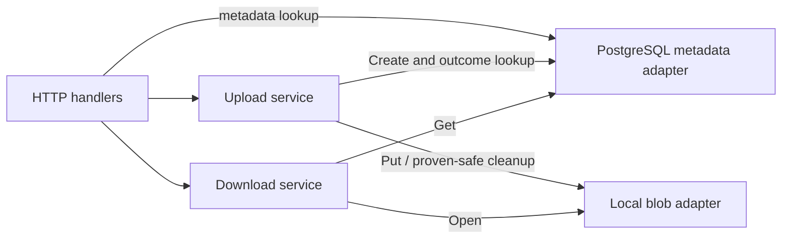

# Next phase: PostgreSQL metadata persistence and recovery

## Readiness decision — 9 September 2026

**Yes: the current working tree is ready to begin this phase.** The completed
foundation supports local file upload, metadata lookup, and download through
separate HTTP, application, and storage layers. PostgreSQL is the next phase
identified in the project README.

This assessment includes the uncommitted adapter refactor and documentation,
not just commit `1a5f01b`. It applies to `goCloudStorage`, the project containing
this lesson; `distributed-file-system` is a separate project.

| Entry check | Evidence | Result |
| --- | --- | --- |
| Complete file flow | `TestFileUploadMetadataDownloadIntegration` checks upload, shared metadata, downloaded bytes, and attachment name | Pass |
| Replaceable metadata backend | Upload consumes `Create`; download and the metadata handler consume `Get`; startup selects adapters | Pass |
| Storage behavior | Tests cover duplicate metadata, blob no-overwrite behavior, validation, cancellation, and upload rollback | Pass |
| Fresh test suite | `go test -count=1 ./...` | Pass |
| Concurrency check | `go test -race -count=1 ./...` | Pass |
| Static checks and compilation | `go vet ./...` and `go build ./...` | Pass |

Checks ran with Go 1.26.4 on Windows/amd64. The module declares Go 1.22;
compatibility with that minimum was not separately tested. Docker CLI and GCC
are on PATH; `psql` was not found on PATH. A running Docker engine or PostgreSQL
server was not verified, so database setup is one of your exercises.

**Ready to start does not mean persistence is implemented.** Metadata still
vanishes on process exit. The upload service assumes every metadata error means
no insert committed. Revise that contract before wiring PostgreSQL into the
server. Rollback already has a separate five-second deadline; preserve it.

## What you will build

The outcome is a single-server application whose metadata and file content remain
usable after a process restart, with explicit handling of uncertain writes and
a conservative recovery procedure. Work through the exercises in order. These
are implementation tasks for you; this lesson does not implement the adapter.



Startup constructs and shares the dependencies. SQL belongs in the PostgreSQL
adapter. File content stays in the local blob directory. The existing HTTP paths,
response shapes, upload limit, and checksum behavior are your compatibility
baseline. Distribution, replication, and an HTTP redesign are later milestones.

## Exercise 1 — Revise the write contract

Read [the upload service](../../internal/upload/service.go),
[the memory adapter](../../internal/storage/memory/metadata_store.go), and
[the failure contract](../architecture.md#failure-and-rollback-contract).

Today the workflow is:

```text
generate ID -> publish blob -> create metadata -> return success
                              |
                              error -> delete blob
```

Consider this failure: PostgreSQL commits the metadata, then the connection fails
before the acknowledgement reaches Go. Deleting the blob would leave a committed
row pointing to missing content. A SQL transaction does not include filesystem
operations. A timeout also does not, by itself, prove that a write did not commit.
The driver documents how cancellation can interrupt a connection; use that as
background for this failure exercise.
([pgconn context behavior](https://pkg.go.dev/github.com/jackc/pgx/v5/pgconn#hdr-Context_Support))

Use this proposed policy for the lesson:

| Create outcome | Upload service behavior |
| --- | --- |
| Confirmed success | Return metadata normally |
| Proven rejection, with no insert and no existing-ID conflict | Attempt bounded blob cleanup; preserve the original error and any cleanup error |
| Duplicate ID | Preserve the blob and report the conflict; never overwrite the existing row |
| Uncertain result | Keep the blob; perform a bounded lookup of the same ID |
| Lookup returns exactly the expected ID, name, size, and checksum | Treat the metadata as confirmed and return success |
| Lookup is missing, different, canceled, or unavailable | Keep the blob and return an unresolved-outcome error for recovery |

A missing row during one lookup is not proof of rollback: the original insert
may still be completing. A duplicate deserves care too: an older metadata row
could already refer to the key even when its content was missing. This is why
this proposed policy preserves content on conflicts.

One approach is to add backend-independent error markers in
`internal/files/errors.go`, such as `ErrCreateNotCommitted` and
`ErrCreateOutcomeUnknown`. Attach the first marker only when an adapter can prove
no insert occurred. Treat unclassified errors as uncertain. Preserve existing
sentinels and underlying causes through `errors.Is` and wrapping. The memory
adapter can classify its failures because it controls the map write.

Give upload a consumer-owned metadata lookup interface for verification. Compare
all four fields. Use a fresh bounded context, such as five seconds derived from
`context.WithoutCancel(ctx)`, for verification and cleanup after cancellation.
Keep the original error if verification cannot resolve the outcome. Do not retry
the entire upload with a new ID.

Your todos:

- [ ] Write `docs/upload-outcomes.md`: explain the table, which errors prove no
  commit, and what an unresolved request returns.
- [ ] Revise the metadata contract, upload service, memory adapter, and test
  fakes. Fake failures representing definite rejection must explicitly carry
  that meaning under the new contract.
- [ ] Test commit-then-error, exact-match reconciliation, missing or mismatched
  lookup, lookup failure, and duplicate ID. Prove uncertain outcomes retain
  the blob and never call `Delete`.
- [ ] Preserve tests for proven rejection, canceled requests, joined cleanup
  errors, and the cleanup deadline.

Checkpoint: `go test ./internal/upload ./internal/storage/memory ./internal/httpapi`
passes. You can explain why `err != nil` no longer automatically means delete.

## Exercise 2 — Set up reproducible database access

Use `pgx/v5` with one shared `pgxpool.Pool`. Pool creation alone does not verify a
connection; startup needs a bounded `Ping`. Startup owns pool closure after HTTP
requests have drained. ([pgxpool API](https://pkg.go.dev/github.com/jackc/pgx/v5/pgxpool))

Your todos:

- [ ] Start local PostgreSQL. If using Docker, add a Compose file with a pinned
  image version, persistent volume, and loopback port binding. Verify an actual
  connection; the CLI's presence is insufficient.
- [ ] Create separate development and test databases. Document creation, start,
  stop, and migration commands in `docs/development.md`. Ordinary stop/start
  must preserve database data.
- [ ] Pin a `pgx/v5` release compatible with the intended Go minimum. Inspect its
  `go.mod`; your installed toolchain does not establish Go 1.22 compatibility.
  Record any deliberate minimum-version change and the versions you tested.
- [ ] Add `.env.example` entries for `DATABASE_URL`, `TEST_DATABASE_URL`,
  `BLOB_DIRECTORY`, and `SERVER_ADDRESS`, using local placeholders. Implement
  environment reading explicitly; Go does not load `.env` files automatically.

Checkpoint: a small Go connection check reaches the development database and
fails within a deadline for an unavailable address. Diagnostics must not print
the database connection string.

## Exercise 3 — Design the schema and implement the adapter

Translate the existing `files.Metadata` deliberately:

| Go field | Suggested SQL representation | Reason |
| --- | --- | --- |
| `ID string` | `id TEXT PRIMARY KEY` | Preserve the opaque-string ID contract |
| `Name string` | `name TEXT NOT NULL` | Display name, independent of the blob path |
| `Size int64` | `size BIGINT NOT NULL CHECK (size >= 0)` | Preserve the byte count range and non-negative invariant |
| `Checksum string` | `checksum TEXT NOT NULL DEFAULT ''` | Empty checksum is currently a valid domain value |

Call `metadata.Validate()` before inserts. Database constraints add protection;
they do not replace Go validation. If adding non-blank SQL checks, consider how
SQL whitespace handling differs from Go's `strings.TrimSpace`. Keep ID and
checksum format restrictions consistent with today's domain model.
([PostgreSQL constraints](https://www.postgresql.org/docs/current/ddl-constraints.html))

The adapter should expose these method signatures:

```go
func (s *MetadataStore) Get(ctx context.Context, id string) (files.Metadata, error)
func (s *MetadataStore) Create(ctx context.Context, metadata files.Metadata) error
```

Use explicit column lists and parameterized SQL, for example
`SELECT id, name, size, checksum FROM files WHERE id = $1`. Pass arguments
separately. Avoid concatenating IDs or names into SQL. Let the primary key decide
concurrent insert conflicts; a preliminary `SELECT` cannot enforce uniqueness.
([pgx query API](https://pkg.go.dev/github.com/jackc/pgx/v5#Conn.QueryRow))

Your todos:

- [ ] Add a versioned migration under `internal/storage/postgres/migrations`.
  Track applied versions; reruns must preserve records. Apply each migration and
  its version record atomically. Document migration serialization; this phase
  can explicitly support one startup process.
- [ ] Create `internal/storage/postgres/metadata_store.go` with an injected pool,
  `Get`, and `Create`. Keep HTTP and application-service imports out of it.
- [ ] Map `pgx.ErrNoRows` to `files.ErrNotFound`. Map SQLSTATE `23505` for the ID
  constraint to `files.ErrAlreadyExists`, using `errors.As` on `*pgconn.PgError`.
  Match structured codes and constraints, not message text.
- [ ] Implement Exercise 1's outcome classification. Validate before sending SQL;
  default transport failures and unclassified write errors to uncertain outcomes.
  Preserve context and driver causes through wrapping.

PostgreSQL identifies unique violations with SQLSTATE `23505`.
([PostgreSQL error codes](https://www.postgresql.org/docs/17/errcodes-appendix.html))

Checkpoint: real database tests cover round-trip metadata, missing IDs, duplicate
no-overwrite behavior, concurrent creates of one ID, invalid metadata, empty
checksum, zero-byte files, names containing quotes, and canceled contexts.
Exactly one concurrent create should succeed.

## Exercise 4 — Wire startup and verify independent storage lifetimes

Read [server startup](../../cmd/server/main.go). It creates one memory store and
shares it with all three metadata consumers. Replace that construction after
Exercise 1's service changes pass.

Pass request contexts into database operations, bound startup work with its own
timeout, and cancel derived contexts when finished.
([Go cancellation guide](https://go.dev/doc/database/cancel-operations))

Your todos:

- [ ] In `run`, load configuration, create and ping the pool, apply migrations,
  construct the adapter, and share it with upload, download, and the metadata
  handler. Initialize dependencies before serving HTTP.
- [ ] Fail startup on missing configuration, failed connection, or migration
  failure. Close initialized resources on failure. Close the pool after HTTP
  shutdown; exercise the existing forced-close path too.
- [ ] Keep the memory adapter for isolated tests. Run the HTTP suite to verify
  status codes, headers, metadata projection, and downloads still agree.
- [ ] Add a database integration test that uploads, discards the first handler and
  closes its pool, builds fresh dependencies with the same database and blob root, then
  retrieves matching metadata and identical content.

Checkpoint: fresh dependencies read the earlier upload without reusing a Go map
or seed records. An unavailable database prevents successful startup. Keep
`/healthz` documented as liveness unless you introduce a separate readiness
contract.

## Exercise 5 — Make incomplete uploads discoverable

Crashes can leave a final blob without metadata or a temporary `.upload-*` file.
A crash after both writes can leave a valid upload whose client never received
success. Recovery must distinguish these states.

For this learning phase, implement an **offline, report-only audit** and a manual
recovery procedure. Run it while the application is stopped. This is a bounded
milestone before background cleanup, leases, or a durable upload-state machine.

| Audit observation | Required handling |
| --- | --- |
| Metadata and matching content exist | Report consistent; an uncertain upload may already have completed |
| Blob exists but metadata is absent | Report unresolved content and retain it; do not invent the original filename |
| Metadata exists but blob is absent | Report missing content; preserve metadata for investigation |
| Temporary upload file exists | Report incomplete staging content and retain it for inspection |
| Content size or checksum differs | Report inconsistency and retain evidence; do not overwrite metadata |
| Database lookup or file inspection fails | Report audit failure; never interpret it as absence |

Your todos:

- [ ] Add a recovery command, such as `cmd/reconcile`, with narrow listing and
  reading dependencies under `internal/recovery`. Keep database enumeration in
  the PostgreSQL adapter and directory enumeration in the local adapter.
- [ ] Compare both directions: metadata rows against blobs, and final blob keys
  against metadata. Stream hashes. Report unknown or empty checksum formats as
  unverifiable instead of calling them valid.
- [ ] Test each table row with isolated data. Repeat the audit and prove it never
  changes rows or content. Report failures visibly and bound database operations.
- [ ] Document recovery in `docs/operations.md`: preserve unresolved files; restore
  metadata only from trustworthy saved metadata and verified content; restore
  missing content from a known copy; leave cases unresolved when evidence is
  insufficient. Record upload IDs and outcomes in diagnostics for investigation.

Checkpoint: you can inspect each inconsistent state repeatedly without losing
data. A bare blob cannot recover its original name by itself. Old blobs from the
in-memory phase are not automatically migrated. Manual recovery has these
explicit limits; automatic cleanup needs a later ownership and recovery design.

## Exercise 6 — Prove restart persistence and record completion

Put database-dependent tests behind the `integration` build tag. When enabled,
require `TEST_DATABASE_URL` and fail clearly if it is unavailable; a skipped
suite must not count as persistence evidence. Use isolated test rows or schemas
and clean up only their own data.

Run from the directory containing `go.mod`. The integration command becomes
applicable after you implement the exercises and set `TEST_DATABASE_URL`:

```powershell
go test -count=1 ./...
go test -race -count=1 ./...
go vet ./...
go build ./...
go test -tags=integration -count=1 ./...
```

Also perform a real process restart. Configure the server with the development
database and a dedicated persistent blob directory, then run it in one terminal.
In a second PowerShell terminal, use this small-file check:

```powershell
$probeRoot = Join-Path ([System.IO.Path]::GetTempPath()) ('gcs-persistence-' + [guid]::NewGuid())
New-Item -ItemType Directory -Path $probeRoot | Out-Null
$sourcePath = Join-Path $probeRoot 'notes.txt'
$downloadPath = Join-Path $probeRoot 'downloaded.txt'
[System.IO.File]::WriteAllText($sourcePath, 'persistent storage lesson')
$createdJson = curl.exe --fail --silent --show-error --form "file=@$sourcePath" 'http://localhost:8080/files'
if ($LASTEXITCODE -ne 0) { throw 'Upload failed' }
$created = $createdJson | ConvertFrom-Json
if (-not $created.id) { throw 'Upload did not return an ID' }
$createdJson | Set-Content -LiteralPath (Join-Path $probeRoot 'uploaded-metadata.json')
$originalHash = (Get-FileHash -LiteralPath $sourcePath -Algorithm SHA256).Hash.ToLowerInvariant()
```

Stop the server with Ctrl+C in its own terminal. Restart it with the same
database and blob directory, wait for a successful health request, and continue
in the second terminal without uploading again:

```powershell
$retrievedJson = curl.exe --fail --silent --show-error "http://localhost:8080/files/$($created.id)?include_checksum=true"
if ($LASTEXITCODE -ne 0) { throw 'Metadata lookup after restart failed' }
$retrieved = $retrievedJson | ConvertFrom-Json
foreach ($field in @('id', 'name', 'size', 'checksum')) {
    if ($retrieved.$field -cne $created.$field) { throw "Metadata mismatch: $field" }
}
curl.exe --fail --silent --show-error --output $downloadPath "http://localhost:8080/files/$($created.id)/content"
if ($LASTEXITCODE -ne 0) { throw 'Download after restart failed' }
$downloadedHash = (Get-FileHash -LiteralPath $downloadPath -Algorithm SHA256).Hash.ToLowerInvariant()
if ($downloadedHash -cne $originalHash) { throw 'Content hash mismatch' }
if ($retrieved.checksum -cne ('sha256:' + $originalHash)) { throw 'Saved checksum mismatch' }
if ((Get-Item -LiteralPath $downloadPath).Length -ne $retrieved.size) { throw 'Content size mismatch' }
Write-Output 'PASS: metadata and matching content survived process restart'
```

Your final todos:

- [ ] Run the ordinary and database integration suites with no unexplained skips.
- [ ] Complete the real restart check. Save commands and results in
  `docs/persistence-verification.md`, including database and driver versions.
- [ ] Exercise failed startup, commit-then-error, unresolved lookup, and the
  offline audit. Record expected versus observed behavior.
- [ ] Update README, architecture, development, and operations docs to describe
  implemented configuration, write contracts, migrations, and recovery limits.

This phase is complete when successful uploads survive restart, errors preserve
potentially committed content, and incomplete uploads can be found and handled
using your recovery procedure. A process-restart test does not establish full
power-loss durability: the local adapter syncs file content but does not
explicitly sync its parent directory.

For your next review, bring the code changes, passing test output, restart proof,
and recovery examples. Start with **Exercise 1**.
